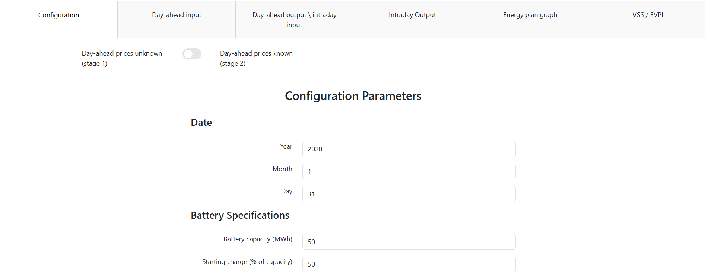
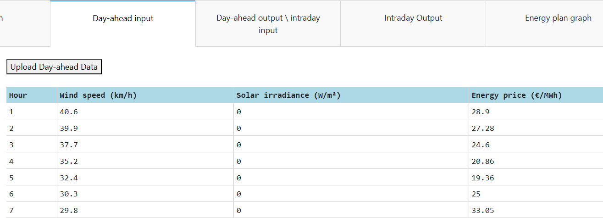
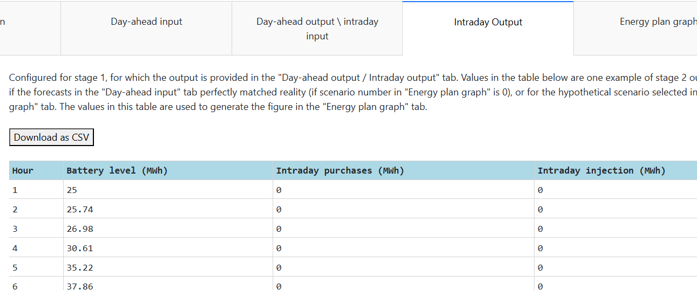
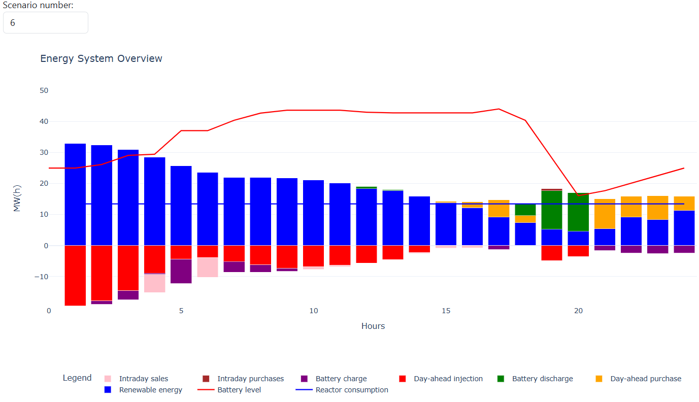
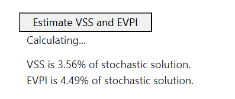

# Planning dashboard for day-ahead energy bids and chemical reactor scheduling

This is a web application that can be found at https://reveal.ugent.be/dash2/.

This application uses a two-stage Mixed Integer Linear Program (MILP) to find the most profitable
24-hour plan for powering an electrically-powered energy-intensive reactor, as part of a plant that contains a 
solar PV array, wind turbines, and a battery energy storage system (BESS). Electricity can also be bought and
sold on the day-ahead and intraday markets.

This model takes into account that the optimal production plan relies on modelling the 
renewable energy generation and electricity prices for the next day. As these values are not 
known with certainty, this model creates multiple possible scenarios based on an input 
forecast, and calculates the production plan that will, on average, generate the most profit
over all scenarios.

## Dash App

#### Tab: Configuration

The first tab on the left is the
Configuration tab. Here, there are approximately 40 fields relating to the plant setup and parameters relating to 
the scenario generation aspect of the model. Each of these parameters is explained in the **Configuration 
Parameters** section below.

Of special importance is the slider at the top, which indicates whether the dashboard is in the "Stage 1" or 
"Stage 2" mode. The behaviour of some of the tabs differs depending on which stage is selected. Therefore, some tab
descriptions are broken into two sections, one for each stage.

#### Tab: Day-ahead input

The second tab is the Day-ahead input tab. Here, the user can input the forecasts for wind speed, solar irradiance,
and day-ahead electricity price. With the exception of the "Hour" column, which is fixed, the forecast values 
can be input manually or uploaded from an external file. If one uploads from an external file, this must be CSV
with exactly 4 columns and 24 rows (not including header row). The data in the columns must be in the same order
as shown in the table on the dashboard, namely "Hour", "Wind", "Solar", and "Price" from left to right. Note that
column names in the CSV do not need to perfectly match the column names shown on the dashboard, as long as the 
data is in the correct order.

This tab behaves the same under "Stage 1" and "Stage 2" modes.

#### Tab: Day-ahead output \ intraday input

**Stage 1:** In "Stage 1" mode, this tab shows the numerical outputs based on the values in the Configuration
and Day-ahead input tabs. This tells the user at what percentage to run the reactor the next day, as well as how
to place electricity bids for purchasing and injecting on the day-ahead market. The table can be downloaded by
clicking the "Download as CSV" button. As this table is calculated, it cannot be edited, manually or by uploading a file. Therefore, the "Upload" button
will not work in this mode.

**Stage 2:** In "Stage 2" mode, this table is another layer of input for the model. It is assumed the production
plan has already been made, and the day-ahead bids have been placed. Therefore, this table is now editable, with
the exception of the "Hours" column. The user can input what the true reactor load percentage is planned to be, 
as well as what day-ahead bids were placed. This can be done manually or uploaded as a CSV. If uploaded, the CSV
must have exactly 4 columns and 24 rows (not including header row). The data in the columns must be in the same order
as shown in the table on the dashboard, namely "Hour", "Reactor load", "Day-ahead purchases", and "Day-ahead
injection" from left to right. An exact matching of column names is not necessary.

#### Tab: Intraday Output

This tab is an output tab in both modes, and therefore can never be edited. The output can always be downloaded
by clicking the "Download as CSV" button. This tab shows the stage 2 output, which is how much electricity needs
to be purchased and injected in the intraday market, as well as how the battery level will fluctuate if one
follows this plan. 

**Stage 1:** This tab is not relevant to Stage 1 decisions and could be ignored. The data it displays is the 
intraday trades and battery levels that would be realized if the forecasts in the Day-ahead input tab are accurate,
and the output in the Day-ahead output \ intraday input tab is followed exactly.

**Stage 2:** This is the output for the Stage 2 model. This shows how intraday market trades and battery levels
should fluctuate to deliver the optimal objective value (profit), when the inputs in the Day-ahead input and 
Day-ahead output \ intraday input tabs are accurate.

#### Tab: Energy plan graph

This tab shows two graphs showing the hourly energy flows (top) and the profit components (bottom). These graphs are 
updated automatically every time a value is changed on another tab, with the exception of the **VSS / EVPI** tab.

**Stage 1:** The graph displays the energy flows for each hour of the day, dynamically updated with the input 
data from the other tabs. The user can also select a scenario number to view, from 0 to the "Number of scenarios" 
specified in the Configuration tab. When scenario 0 is selected, the graph shows exactly what is entered in the 
Day-ahead input, Day-ahead output \ intraday input and Intraday Output tabs. When a positive scenario number is chosen, the graph
shows what the energy flows would look like under one of the stochastic scenarios it used when solving the model.
As this shows possible realizations after the Stage 1 decisions are made, the reactor load and day-ahead bids
remain the same for each scenario. However, the renewable energy generation (blue bars) change for each scenario,
and therefore the Stage 2 solution comprising of intraday trading and battery usage, is also different for each
scenario.

**Stage 2:** This graph shows exactly what is entered in the Day-ahead input, 
Day-ahead output \ intraday input and Intraday Output tabs. As Stage 2 is designed to be run once the uncertain
parameters become known, there are no scenarios to explore here. The number in the "Scenario number" box has no 
effect on the graph.

Similarly to the Energy plan graph, there is a graph underneath which displays the components of the profit
calculation each hour. A dropdown list shows all of the components that can be added or removed from this 
graph. This also changes to reflect each scenario.

#### Tab: VSS / EVPI

This tab has a single button, "Estimate VSS and EVPI." When clicked, two metrics will be calculated that are 
related to the impact of uncertainty on the model performance. 
* VSS (Value of stochastic solution): This is how much the objective value (here, profit) of our model (i.e. 
the stochastic solution) differs from the objective value of the solution obtained assuming only the forecast data is used
(i.e. the deterministic solution). This is displayed as a percentage of the model (stochastic solution) objective.
* EVPI (Expected value of perfect information): This is the difference between the objective value of our model
and the objective value of a solution generated that assumes perfect future knowledge of the wind, solar irradiance, and
electricity prices. This is also displayed as a percentage of the model (stochastic solution) objective.

As this requires some extended computation, these calculations may take a minute or more to run.

### Configuration parameters

Below is an explanation of the parameters in the Configuration tab.

#### <u>Date</u>

**Year**: Numerical year of planning period.  

**Month**: Numerical month of planning period. 

**Day**: Numerical day of planning period. 

#### <u>Battery specifications</u>

**Battery capacity (MWh)**: Battery capacity in MWh.

**Starting charge (% of capacity)**: Battery percentage at the beginning of the planning period.

**Charge efficiency**: Proportional energy loss while charging the battery. Value is a fraction between 0 and 1,
with 1 indicating no energy loss.

**Discharge efficiency**: Proportional energy loss while discharging the battery. Value is a fraction between 0 and 1,
with 1 indicating no energy loss.

**Max charging speed (MW)**: Maximum speed at which battery may be charged, in MW. This is normally around the speed 
needed to take the battery from full to empty in four hours, for a lithium-ion battery.

**Max discharging speed (MW)**: Maximum speed at which battery may be discharged in, MW. This is normally around the 
speed needed to discharge the battery from full to empty in four hours, for a lithium-ion battery.

**Degradation cost (€/MWh)**: Battery degradation cost, taken to be proportional to throughput. This is in units of 
€/MWh.

#### <u>Constants</u>

**Intraday penalty multiplier**: Intraday trading is penalized at a rate calculated as a multiple of the highest predicted
day-ahead rate for the planning period. A value close to 1 simulates a situation where intraday trading is not much more 
expensive than day-ahead trading, and a value much greater than 1 indicates intraday trading is especially disadvantageous.

**Number of scenarios for model generation**: The number of scenarios generated for the Stage 1 stochastic model. 
More scenarios give better results, but also take more time to calculate. When set to 0, no scenarios are generated and 
the deterministic solution is calculated (i.e., the optimal day-ahead trading plan, reactor level values, and BESS usage 
assuming the forecast is perfect).

**Number of scenarios for evaluation**: The number of scenarios generated for the VSS and EVPI calculations. These 
are the scenarios that the solution from Stage 1 is tested on. More scenarios give better results, but also take more 
time to calculate.

#### <u>Scenario generation parameters</u>

**Sigma magnitude electricity price (€)**: Indicates the uncertainty in the day-ahead price forcast with regards to the magnitude. 
A higher number indicates more uncertainty.

**Sigma magnitude sun (W/m²)**: Indicates the uncertainty in the solar irradiance forcast with regards to the 
magnitude. A higher number indicates more uncertainty.

**Sigma magnitude wind (km/h)**: Indicates the uncertainty in the wind speed forcast with regards to the magnitude. 
A higher number indicates more uncertainty.

**Sigma shift electricity price (h)**: Indicates the uncertainty in the day-ahead price forcast with regards to timing. A higher
number indicates more uncertainty.

**Sigma shift sun (h)**: Indicates the uncertainty in the solar irradiance forcast with regards to timing. A higher
number indicates more uncertainty.

**Sigma shift wind (h)**: Indicates the uncertainty in the wind speed forcast with regards to timing. A higher
number indicates more uncertainty.

#### <u>PV array specifications</u>

**Area (m²)**: Area of the PV array in m2.

**Efficiency**: Fraction of energy converted to electricity. This should be a decimal between 0 and 1.
 
#### <u>System specifications</u>

**CO2 Consumption (Kg/h)**: Rate at which CO2 is consumed when reactor is running at full capacity. Kg/h.

**CO2 Credits Price (€/Kg)**: Value of CO2 credits, in €/Kg.

**CO Price (€/Kg)**: Revenue from CO, in €/Kg.

**CO Production (Kg/h)**: Rate of CO production when reactor is running at full capacity, in Kg/h.

**Electricity Consumption (MW)**: Rate of electric energy consumption when reactor is running at full capacity, in MW.

**H2S Consumption (Kg/h)**: Rate at which H2S is consumed when reactor is running at full capacity. Kg/h.

**H2S Purchase Price (€/Kg)**: Price at which H2S must be purchased. €/Kg.

**Sulfur Price (€/Kg)**: Revenue from sulfur in €/Kg.

**Sulfur Production (Kg/h)**: Rate of sulfur production when reactor is running at full capacity in Kg/h.

**Reactor Max Production**: The maximum fraction of capacity the reactor is allowed to run at in this time period. This is 
a production level between 0 and 1, where 1 indicates that the reactor is allowed to run up to 100% capacity.

**Reactor Min Production**: The minimum fraction of capacity the reactor is allowed to run at in this time period. 
This is a production level between 0 and 1, where 0 indicates that the reactor is allowed to 
be completely shut off.

#### <u>Wind turbine specifications</u>

**Number of Turbines**: Number of wind turbines.

**Cut-in Wind Speed (km/h)**: Minimum wind speed needed for the wind turbines to start producing energy, in km/h. 
Below this value no energy is produced.

**Rated Speed (km/h)**: Wind speed at which the wind turbines are producing their maximum energy. Above this value, 
and below the cut-off, the energy production is constant.

**Cut-out Wind Speed (km/h)**: Maximum wind speed at which the wind turbines can safely produce energy, in km/h. 
Above this value the wind turbines must shut down and no energy is produced.

**Maximum Energy (kW)**: Size of the wind turbine in kW.

